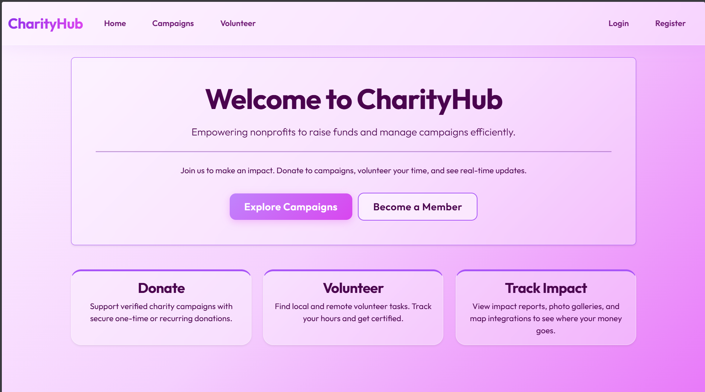

<div align="center">

# 🌍 CharityHub

**A secure, full-featured non-profit donation and volunteer management platform**



*Built with Laravel 11 · Stripe · Filament PHP · FullCalendar.js · Google Maps*


> Developed as a course project for the **Web Development & Security** course  
> ElSewedy University of Technology (SUT) — Networks & Cybersecurity Department

</div>

---

## 📖 Table of Contents

- [Overview](#-overview)
- [Key Features](#-key-features)
- [Technology Stack](#-technology-stack)
- [Security Implementation](#-security-implementation)
- [Requirements](#-requirements)
- [Installation & Setup](#-installation--setup)
- [Environment Variables](#-environment-variables)
- [Running the Application](#-running-the-application)
- [Testing](#-testing)
- [Project Structure](#-project-structure)
- [Screenshots](#-screenshots)

---

## 🧭 Overview

CharityHub is a comprehensive web platform built for non-profit organizations to manage fundraising campaigns, process secure donations, coordinate volunteer activities, and automate donor certificate issuance — all from a single, secure application.

The project was built against a **20-point technical audit** covering payments, security, event systems, frontend interactivity, admin tooling, testing, and documentation — achieving a full **20/20 implementation**.

---

## ✨ Key Features

### 💳 Payments & Donations
- **One-time and recurring (monthly) donations** via Stripe Checkout
- **Idempotency protection** — prevents accidental double-charging on page refresh or double-click
- **Stripe Webhook listener** — automatically records recurring subscription renewals and cancellations in real time
- **Payment abstraction layer** — Stripe is fully decoupled behind a `PaymentGatewayInterface` for easy swapping and unit testing

### 📜 Automated Donor Certificates
- **PDF certificate generation** on every successful donation using `barryvdh/laravel-dompdf`
- **QR code embedded** in each certificate for instant public verification
- **Queued email delivery** — certificate is emailed to the donor automatically without blocking the HTTP response
- **IDOR protection** — strict authorization ensures a donor can only access their own certificate

### 🗺️ Campaigns & Geolocation
- **Full CRUD** for campaigns with image uploads stored on the public disk
- **SEO-friendly slug routing** — human-readable URLs (`/campaigns/save-the-forest`)
- **Google Maps integration** — each campaign page renders an interactive map pin at the campaign's location
- **Open Graph meta tags** — campaign links shared on social media auto-preview with the campaign image and description
- **Real-time progress bars** via Livewire polling — no full page reload needed

### 🤝 Volunteer Management
- **FullCalendar.js scheduling interface** — volunteers browse tasks visually by date
- **Conflict prevention** — the system blocks double-booking a volunteer on the same day
- **Capacity enforcement** — tasks close registration when the slot limit is reached
- **Hour logging UI** — registered volunteers log actual hours worked; backend validation prevents logging more hours than the task requires
- **Volunteer report page** — side-by-side comparison of hours logged vs. hours required per task

### 🛡️ Authentication & Authorization
- **Email/password authentication** with Laravel's built-in auth system
- **Google OAuth** via Laravel Socialite — one-click sign in
- **Role-based access control** (Admin / User) powered by Spatie Laravel-Permission
- **Isolated Filament admin panel** at `/admin` — completely segregated from the main `web` middleware group

### 🖥️ Admin Panel (Filament PHP v3)
- Full CRUD resources for: **Users, Campaigns, Donations, Volunteer Registrations, Volunteer Tasks**
- Live dashboard stats: **Total Donations raised, Active Campaigns, Total Volunteers**
- Restricted exclusively to users with the `Admin` role

---

## 🛠️ Technology Stack

| Layer | Technology |
|---|---|
| Framework | Laravel 11 (PHP 8.2+) |
| Database | MySQL 8.0+ |
| Admin Panel | Filament PHP v3 |
| Payment Gateway | Stripe PHP SDK + Webhooks |
| OAuth | Laravel Socialite (Google) |
| Real-time UI | Livewire v3 |
| PDF Generation | barryvdh/laravel-dompdf |
| QR Codes | SimpleSoftwareIO/simple-qrcode |
| Frontend | Bootstrap 5, FullCalendar.js, Google Maps JS API |
| Email | SMTP (Mailtrap / any provider) with Laravel Queues |
| Testing | PHPUnit with Mockery |

---

## 🔐 Security Implementation

Security was a primary design consideration throughout the build, not an afterthought.

| Threat | Mitigation |
|---|---|
| **Double-charging (Race Condition)** | Deterministic idempotency keys checked before every Stripe session creation |
| **Broken Access Control (IDOR)** | Certificate and hour-logging endpoints verify ownership before serving data |
| **Mass Assignment** | All Eloquent models use `$fillable` whitelists |
| **Malicious File Upload** | MIME type validation (`jpeg, png, jpg, gif`) + isolated `public` disk storage |
| **Admin Panel Exposure** | Filament panel runs under its own middleware stack, completely isolated from `routes/web.php` |
| **CSRF on Webhooks** | Stripe webhook route exempted from CSRF via explicit exception in `bootstrap/app.php`; verified with Stripe signature instead |
| **Privilege Escalation** | Spatie role checks enforced at both route middleware and controller level |
| **Sensitive Key Exposure** | All secrets in `.env` (never hardcoded); `.env` excluded from version control |

---

## 📋 Requirements

- PHP >= 8.2 with extensions: `intl`, `gd`, `pdo_mysql`, `openssl`
- Composer >= 2.x
- MySQL >= 8.0
- A [Stripe](https://stripe.com) account (for API keys + webhook secret)
- A [Google Cloud Console](https://console.cloud.google.com) account (for Maps JS API + OAuth credentials)
- An SMTP provider ([Mailtrap](https://mailtrap.io), Gmail, Resend, etc.)

---

## 🚀 Installation & Setup

### 1. Clone the repository
```bash
git clone https://github.com/your-username/charityhub.git
cd charityhub
```

### 2. Install PHP dependencies
```bash
composer install
```

### 3. Configure the environment
```bash
cp .env.example .env
php artisan key:generate
```
Open `.env` and fill in your database, Stripe, Google, and mail credentials.  
Every key is documented with instructions directly inside `.env.example`.

### 4. Run migrations and seed roles
```bash
php artisan migrate --seed
```

### 5. Link storage for image uploads
```bash
php artisan storage:link
```

### 6. Enable the PHP `intl` extension (XAMPP / Windows)
Open `php.ini`, find `;extension=intl`, remove the semicolon, and restart Apache.

---

## 🔑 Environment Variables

All required keys are documented in `.env.example`. Key groups:

```env
# Application
APP_KEY=
APP_URL=

# Database
DB_CONNECTION=mysql
DB_DATABASE=charityhub

# Stripe
STRIPE_KEY=pk_test_...
STRIPE_SECRET=sk_test_...
STRIPE_WEBHOOK_SECRET=whsec_...

# Google
GOOGLE_MAPS_API_KEY=AIzaSy...
GOOGLE_CLIENT_ID=...
GOOGLE_CLIENT_SECRET=...
GOOGLE_REDIRECT_URI=http://127.0.0.1:8000/auth/google/callback

# Mail (SMTP)
MAIL_MAILER=smtp
MAIL_HOST=live.smtp.mailtrap.io
MAIL_PORT=587
MAIL_USERNAME=api
MAIL_PASSWORD=your_mailtrap_api_token

# Queue
QUEUE_CONNECTION=database
```

---

## ▶️ Running the Application

Start the development server and queue worker in two separate terminals:

```bash
# Terminal 1 — web server
php artisan serve

# Terminal 2 — queue worker (required for certificate emails)
php artisan queue:work
```

Then visit:
- **Main app:** `http://127.0.0.1:8000`
- **Admin panel:** `http://127.0.0.1:8000/admin`

To create an admin user, assign the `Admin` role via tinker:
```bash
php artisan tinker
$user = App\Models\User::find(1);
$user->assignRole('Admin');
```

---

## 🧪 Testing

The test suite uses `Storage::fake()` and Mockery to safely intercept all third-party API calls — no real Stripe charges or file writes occur during tests.

```bash
php artisan test
```

Test coverage includes:

| Module | What is tested |
|---|---|
| **Payments** | One-time session creation, duplicate idempotency key rejection, recurring subscription mode |
| **Certificates** | Donor can download own certificate, unauthorized access returns 403 |
| **Campaigns** | Image upload stores correctly, slug routing resolves correct campaign |
| **Volunteers** | Hours exceeding limit are rejected, only registered volunteers can log hours |

---

## 📁 Project Structure

```
app/
├── Contracts/          # PaymentGatewayInterface
├── Services/           # StripePaymentService
├── Events/             # DonationReceived
├── Listeners/          # SendCertificateNotification, LogFinancialTransaction
├── Jobs/               # SendDonorCertificateJob
├── Mail/               # DonorCertificateMail
├── Livewire/           # CampaignProgressBar
├── Filament/           # Admin panel resources
│   └── Resources/      # Campaign, Donation, User, Volunteer resources
└── Http/
    └── Controllers/Web/
        ├── DonationsController.php
        ├── CertificateController.php
        ├── CampaignsController.php
        ├── VolunteerController.php
        └── StripeWebhookController.php
```

---

## 📸 Screenshots

| Page | Description |
|---|---|
| `/campaigns` | Campaign grid with Livewire real-time progress bars and uploaded images |
| `/campaigns/{slug}` | Campaign detail with Google Map, social sharing, and donate button |
| `/volunteer` | FullCalendar.js task scheduling interface |
| `/admin` | Filament dashboard with live donation and campaign stats |
| Certificate PDF | Auto-generated certificate with embedded QR code |

---

<div align="center">

Built with ❤️ for the Web Development & Security course  
ElSewedy University of Technology · Networks & Cybersecurity

</div>